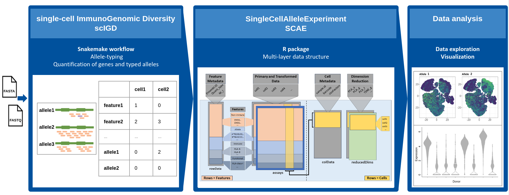
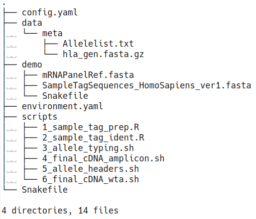

# Biological background and motivation

Immune molecules such as B and T cell receptors, human leukocyte antigens (HLAs) or killer Ig-like receptors (KIRs) are encoded in the genetically most diverse loci of the human genome. Many of these immune genes are hyperpolymorphic, showing high allelic diversity across human populations. In addition, typical immune molecules are polygenic, which means that multiple functionally similar genes encode the same protein subunit. 

However, integrative single-cell methods commonly used to analyze immune cells in large patient cohorts do not consider this. This leads to erroneous quantification of important immune mediators and impaired inter-donor comparability, which ultimately obscures immunological information contained in the data.

In response to these challenges, we introduce `scIGD`. This Snakemake workflow not only automates HLA allele-typing processes, but also enables allele-specific quantification from single-cell RNA-sequencing (scRNA-seq) data.

# scIGD workflow

## Automated genotyping and allele-specific quantification for immune genes from scRNA-seq data

**scIGD** (**s**ingle-**c**ell **I**mmuno**G**enomic **D**iversity) is a *[Snakemake](https://snakemake.readthedocs.io/en/stable/)* workflow that has been designed to automate and streamline the genotyping process for HLA genes, and enabling allele-specific quantification from scRNA-seq data using donor-specific references.

The workflow is organized into three distinct stages, each addressing specific objectives (Figure 1):

1. **Demultiplexing multiplexed scRNA-seq datasets:**
   
   - The initial stage is focused on demultiplexing scRNA-seq datasets which contain reads from multiple donors or samples. Thus, this step is skipped if the input data consists of only a single donor. The primary goal of this step is to generate donor-specific FASTQ files, which are essential for subsequent genotyping and allele-specific quantification.

2. **Allele-typing procedures on immune genes:**
   
   - Following demultiplexing, the workflow executes allele-typing procedures on HLAs. This process utilizes *[arcasHLA](https://github.com/RabadanLab/arcasHLA)*, which extracts reads mapped to chromosome 6 (housing the HLA genes), and uses the *[IMGT/HLA](https://www.ebi.ac.uk/ipd/imgt/hla/)* database and an Expectation-Maximization (EM) model to determine the most representative HLA alleles.

   - The output for each gene will consist of one or two alleles that best match the data.

3. **Quantification of genes and typed alleles:**
   
   - The final stage involves the quantification of genes and typed alleles. *[Kallisto](https://www.kallistobus.tools/)*, an alignment-free tool for rapid transcript quantification, is utilized with the newly built donor-specific reference generated in the previous stage. 
   
   - The resulting output is a count matrix, which provides expression levels for both genes and specifically typed alleles, enabling downstream analysis and exploration of gene and allele expression patterns.

This workflow is designed to support both *10x* and *BD Rhapsody* data, encompassing amplicon/targeted sequencing as well as whole-transcriptome-based data, providing flexibility to users working with different experimental setups.

To maximize the analytical potential of the results, we have created an `R/Bioconductor` package, *[SingleCellAlleleExperiment](https://bioconductor.org/packages/SingleCellAlleleExperiment)*. This package provides a comprehensive multi-layer data structure, enabling the representation of HLA genes at various levels, including alleles, genes, and functional classes.



**Figure 1:** Overview of the *scIGD* workflow for unraveling immunogenomic diversity in single-cell data, highlighting the integration of the *SingleCellAlleleExperiment* package for comprehensive data analysis.

# Installation

## Preparing a working directory

First, create a new directory `scIGD` at a place you can easily remember and change into that directory in your terminal:

```bash
mkdir scIGD
cd scIGD
```

Then, download the workflow:

```bash
curl -L https://api.github.com/repos/AGImkeller/scIGD/tarball -o scIGD.tar.gz
```

Next, extract the data. On Linux, run:

```bash
tar --wildcards -xf scIGD.tar.gz --strip 1 "*/data" "*/demo" "*/scripts" "*/Snakefile" "*/config.yaml" "*/environment.yaml" && chmod +x ./scripts/*.sh
```

On MacOS, run:

```bash
tar -xf scIGD.tar.gz --strip 1 "*/data" "*/demo" "*/scripts" "*/Snakefile" "*/config.yaml" "*/environment.yaml" && chmod +x ./scripts/*.sh
```

This will create three files: `Snakefile`, `config.yaml` and `environment.yaml`. In addition, three folders will be created: `data`, `demo` and `scripts` (Figure 2).



**Figure 2:** Overview of the folder strcutre.

## Creating an environment with the required software

Assuming that you have a 64-bit system, on Linux, download and install Miniconda 3 with:

```bash
curl -L https://github.com/conda-forge/miniforge/releases/latest/download/Mambaforge-Linux-x86_64.sh -o Mambaforge-Linux-x86_64.sh
bash Mambaforge-Linux-x86_64.sh
```

If you are asked the question

`Do you wish the installer to prepend the install location to PATH ...? [yes|no]`

answer with **yes**. Along with a minimal Python 3 environment, Mambaforge contains the package manager [Mamba](https://github.com/mamba-org/mamba). After closing your current terminal and opening a new terminal, you can use the new `conda` command to install software packages and create isolated environments to, for example, use different versions of the same package. We will now utilize this to create an isolated environment with all the required software for this workflow.

First, make sure to activate the conda base environment with:

```bash
conda activate base
```

The `environment.yaml` file that you have obtained with the previous step (Preparing a working directory) can be used to install all required software into an isolated Conda environment with the name `scIGD` via:

```bash
mamba env create --name scIGD --file environment.yaml
```

Written in C++, [Mamba](https://github.com/mamba-org/mamba) is a faster and more robust reimplementation of [Conda](https://docs.conda.io/en/latest/).

Once the environment has been created, activate it by executing: 

```bash
conda activate scIGD
```

and deactivate it by executing: 

```bash
conda deactivate
```

(but don't do this if you want to run the workflow now)

# Input data

Upon preparation of the working directory, two essential folders were generated: `data` and `scripts` (refer to Figure 2).

The `scripts` directory houses essential scripts integral to the workflow's execution, requiring no user intervention.

On the other hand, the `data` directory serves as a space for metadata necessary for the workflow. Within its `meta` subfolder, two files are found. Both files are retrieved from the *IMGT/HLA* database and necessary for *arcasHLA* allele-typing:

- `Allelelist.txt`: A CSV file listing all HLA alleles named at the time of the latest release.

- `hla_gen.fasta.gz`: A FASTA file including the DNA sequence for all HLA alleles, which have genomic sequences available.

In addition, users are required to supply the following files. Some example files can be found in the `demo` folder:

- `FASTQ files`: Raw, gzipped FASTQ files.

- `SampleTagSequences.fasta`: This is necessary **only if the data is multiplexed**. It should contain a FASTA file of sample tag sequences crucial for demultiplexing the data and generating donor-specific or sample-tag-specific FASTQ files.

- `mRNAPanelRef.fasta`: Essential for **amplicon-based data**, this FASTA file contains the panel reference used.

- `Homo_sapiens.GRCh38.dna.primary_assembly.fa.gz` and `Homo_sapiens.GRCh38.112.gtf.gz`: For **whole-transcriptome-based data**, you must provide a gzipped FASTA file of the reference and its corresponding gtf file. These files should be obtained from [Ensembl](https://www.ensembl.org/index.html): [Ref](https://ftp.ensembl.org/pub/release-112/fasta/homo_sapiens/dna/) and [GTF](https://ftp.ensembl.org/pub/release-112/gtf/homo_sapiens/).

# Configuration

The configuration for this workflow is designed to offer flexibility and adaptability to different user requirements. Users can customize their parameters in a dedicated configuration file (`config.yaml`) to suit specific use case and control various aspects of the workflow. Examples for populating these parameters are provided in the `config.yaml` file. Please ensure all paths defined in this configuration file are either absolute or relative to the location of the `Snakefile`!

Below are the essential parameters available for configuration:

- `wta`: Determines the experiment setup. Set to `true` for whole-transcriptome-based data, and `false` for amplicon-based data.

- `multiplex`: Specifies the presence of multiple donors or samples in a dataset. Set to `true` for multiplexed data, and `false` for datasets with a single donor. Currently, this feature only works for BD Rhapsody data.

- `output`: Path to a folder that will store the output generated by the workflow.

- `threads_number`: The maximal number of threads or cores to use for demultiplexing, STAR and arcasHLA.

- `sequencing_technology`: Indicates the sequencing technology used, possible options: 10XV1, 10XV2, 10XV3, BDWTA.

- `genes_to_be_allele_typed`: Provides a list of genes on which allele-typing will be performed. This parameter specifically supports HLA genes and will be extended to include KIRs in future releases.

- `raw_data_fastq_list`: Provides a list of paths to raw, gzipped FASTQ files. Each file should adhere to the naming format: `{dir_raw_fastq}/*_R1.fastq.gz` for Read 1 and `{dir_raw_fastq}/*_R2.fastq.gz` for Read 2.

- `sample_tag_seqs`: Provides the path to a FASTA file containing sample tag sequences. This is applicable when the input data is multiplexed, and sample tags are used to differentiate between samples.

- `read_length`: Specifies the read length in R1 file in base pairs. Set only if the input data is multiplexed.

- `amplicon_cDNA_fasta`: Provides the path to a FASTA file containing amplicon cDNA sequences. Set only for amplicon-based sequencing.

- `single_end_sequencing`: Set to `true` for single-end sequencing and `false` for paired-end sequencing. Set only for whole-transcriptome-based data.

- `reference_genome_gtf`: Provides the path to the GTF file with annotation information for the reference genome. Set for whole-transcriptome-based data.

- `reference_genome_fasta`: Provides the path to the FASTA file containing the primary assembly of the reference genome. Set for whole-transcriptome-based data.

# Running the workflow

Begin by confirming that you are in the directory containing the `Snakefile`. Once confirmed, you only need to execute the following command:

```bash
snakemake --resources mem_gb=<your_memory_allocation> --cores <your_core_count> all
```

Replace `<your_memory_allocation>` with the desired memory allocation value, and `<your_core_count>` with the desired number of CPU cores for parallel execution of the workflow. This flexibility allows you to tailor the resource allocation based on your system's capabilities and requirements. We recommend allocating a *minimum* of 12 GB of memory and utilizing 12 CPU cores for optimal performance.

Additionally, it's worth noting that using amplicon-based data is significantly faster than whole-transcriptome-based data, as the latter requires the generation of a BAM file, which is computationally expensive.

This workflow has been rigorously tested. Here, we report two distinct scenarios:

1. Amplicon-based data:

   - 8 donors, 280 million reads in 1 FASTQ file
   - Completed in 80 minutes utilizing 8 CPU cores and 8 GB of memory

2. Whole-transcriptome-based data:

   - 1 donor, 50 million reads in 1 FASTQ file
   - Completed in ~ 3 hours utilizing 32 CPU cores and 40 GB of memory

When dealing with whole-transcriptome-based data, it is advisable to use the tool on a cluster. A Snakefile that was executed on a SLURM cluster can be found in the `demo` folder. It was run with the following parameters: `nodes=1`, `ntasks=1`, `cpus-per-task=40` and `mem-per-cpu=2000`.

# Output

As a product of *kallisto*, the resulting output comprises a count matrix (`cells_x_genes.mtx`), a feature list encompassing genes and typed-alleles (`cells_x_genes.genes.txt`), and a barcode list (`cells_x_genes.barcodes.txt`). The matrix serves as a source for downstream analysis and exploration, capturing the expression levels of genes and specifically typed alleles.

In addition, the output includes a lookup table (`lookup_table_HLA.csv`) to facilitate the creation of the relevant additional data layers during object generation for analysis.

Example datasets and outputs are available in our data package hosted on Bioconductor's `ExperimentHub`: *[scaeData](https://bioconductor.org/packages/scaeData)*.

To facilitate the analysis of this output, we offer a structured data representation in the form of an `R/Bioconductor` package named *[SingleCellAlleleExperiment](https://bioconductor.org/packages/SingleCellAlleleExperiment)*. For detailed instructions on utilizing this package, please refer to its documentation.

# Quality control checks

A comprehensive QC framework is essential to ensure reliable allele-specific results: 
- `Empty-droplet filtering`: Inspect the barcode-rank knee plot to ensure a clear inflection point and exclude low-UMI barcodes.

- `Library complexity`: Plot total UMI counts and detected gene counts per cell; flag cells with unusually low or high values.

- `Contamination metrics`: Monitor per-cell mitochondrial and ribosomal read fractions to identify stressed or dying cells.

- `Normalization assessment`: Examine the distribution of size factors across cells; should be unimodal and not overly skewed.

- `Allele-ratio distribution`: Generate per-gene allele-ratio histograms; a high proportion of 0% or 100% calls may indicate coverage issues or mis-assignment.

- `Cross-platform comparison`: Compare aggregate allele-ratio distributions to bulk or orthogonal allele-specific measurements, if available.

- `Gene-level consistency`: Confirm that summed allele-specific counts recapitulate standard gene-level quantification (e.g., Cell Ranger, Salmon).

# References

## Tools and packages

- Snakemake: Koster, J., & Rahmann, S. (2012). Snakemake - a scalable bioinformatics workflow engine. Bioinformatics, 28(19), 2520-2522.

- R: R Core Team (2023). R - a language and environment for statistical computing.

- Tidyverse: Wickham H. *et al.*, (2019). Welcome to the tidyverse. Journal of Open Source Software, 4(43), 1686.

- Matrix: Bates D. *et al.*, (2023). Matrix - sparse and dense matrix classes and methods.

- ShortRead: Morgan M. *et al.*, (2009). ShortRead - a Bioconductor package for input, quality assessment and exploration of high-throughput sequence data. Bioinformatics 25:2607-2608.

- sparseMatrixStats: Ahlmann-Eltze C. (2023). sparseMatrixStats - summary statistics for rows and columns of sparse matrices.

- ExperimentHub: Morgan M, Shepherd L (2023). ExperimentHub - client to access ExperimentHub resources.

- kb-python: Melsted P., Booeshaghi A.S. *et al*, (2021). Modular, efficient and constant-memory single-cell RNA-seq preprocessing. Nature Biotechnoly 39, 813-818.

- kallisto: Bray NL. *et al*, (2016). Near optimal probabilistic RNA-seq quantification. Nature Biotechnology 34, 525-527.

- SeqKit: Shen W. *et al*, (2016). SeqKit - a cross-platform and ultrafast toolkit for FASTA/Q file manipulation.

- Seqtk: a fast and lightweight tool for processing sequences in the FASTA or FASTQ format. https://github.com/lh3/seqtk.

- STAR: Dobin A. *et al*, (2013). STAR - an ultrafast universal RNA-seq aligner. Bioinformatics, 29(1), 15-21.

- Samtools: Danecek P. *et al*, (2021). Tools for alignments in the SAM format. GigaScience, 10(2).

- arcasHLA: Orenbuch R. *et al*, (2019). High resolution HLA typing from RNA seq. Bioinformatics, 36(1), 33-40.

- Bioconda: Gruening B. *et al*, (2018). Bioconda - sustainable and comprehensive software distribution for the life sciences. Nature Methods 15, 475-476.

## Data resources

- 10x Genomics: https://www.10xgenomics.com/datasets.

- Ensembl: Martin F. *et al*, (2023). Nucleic Acids Research, 51, 933-941.

## Citation

To be added.....

## Authors

- [Ahmad Al Ajami](https://github.com/ahmadalajami), [Katharina Imkeller](https://github.com/imkeller)